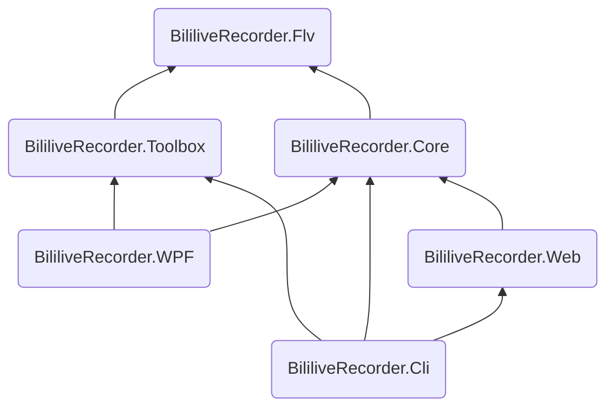

# 项目结构

录播姬主要分为以下几个项目

项目名 | Target | 说明
:---- | :-----: | :---
BililiveRecorder.Flv | .NET Standard 2.0 | FLV 解析、处理(修复)、和输出
BililiveRecorder.Core | .NET Standard 2.0 | 核心逻辑，包括直播状态检测、直播录制、弹幕录制等
BililiveRecorder.Toolbox | .NET Standard 2.0 | 基于 Flv 项目实现的工具箱，如录播修复等
BililiveRecorder.WPF | .NET Framework 4.7.2 | WPF 界面，也就是 “录播姬桌面版”
BililiveRecorder.Web | .NET 6 | 跨平台 ASP.NET Core 项目，提供各种 API，不能独立运行
BililiveRecorder.Cli | .NET 6 | 跨平台的 “录播姬命令行版”，通过 Web 项目提供 API

除此以外还有两个测试项目，不过目前测试相对还是很少。

项目名 | Target | 说明
:---- | :-----: | :---
BililiveRecorder.Flv.Tests | .NET 6 | FLV 数据处理相关测试，是测试的重点
BililiveRecorder.Core.UnitTests | .NET 6 | 应该是核心录制逻辑的测试，实际上完全没写
