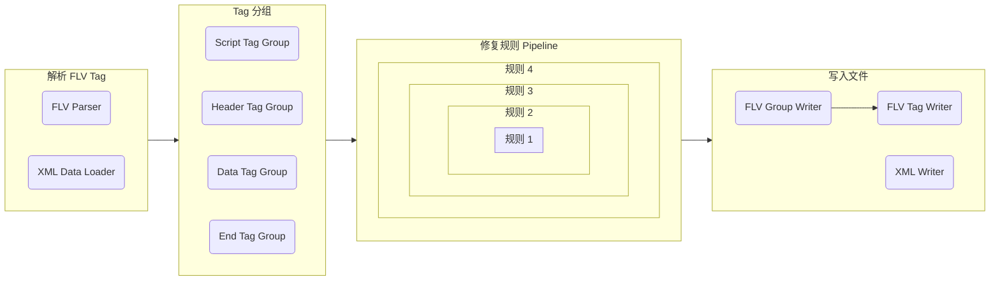
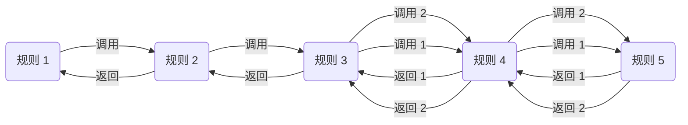

# 录播修复系统

本文档是面向开发者和想了解录播姬的修复系统底层逻辑的人编写的。

这里所说的录播修复是 录播姬 1.3 加入的功能，1.2 及以前的版本是没有的。

本站所有文档内容，另有说明的除外，都按 [CC-BY-NC-SA :fontawesome-brands-creative-commons::fontawesome-brands-creative-commons-by::fontawesome-brands-creative-commons-nc::fontawesome-brands-creative-commons-sa:](https://creativecommons.org/licenses/by-nc-sa/4.0/deed.zh){ target=_blank } 协议授权。

如果本文档和录播姬的录播修复系统对你有帮助，请在你的项目或软件里给出 credit，谢谢。

!!! example "例子"
    本软件的某功能参考了[B站录播姬](https://rec.danmuji.org)录播修复系统的设计 和/或 代码。  
    (链接可以是网站首页、本文档页、或录播姬的 GitHub 仓库页)

??? fail "反面例子"
    某订阅制付费、每月 30 元、还限制每日使用量的录播软件直接复制粘贴了录播姬的数据处理代码，并对编译输出进行了混淆。

## 为什么需要自己修复

直播服务器给的直播流数据经常会有一些直播播放器能播放，但是一般视频播放器播放有困难的数据。
造成这个现象的原因可能是直播服务器的实现不够“完美”，不过这也是没办法的事。

B站网页/手机客户端直播播放器对这些直播数据的“兼容性”更好，就算播放出现问题，用户也可以刷新一下页面继续看。
而把直播流存成文件用本地的普通视频播放器播放时，这些问题的影响就比较大了。

FFmpeg 不能解决这些问题，甚至会把很多问题搞得更难修复。

比如下面写的解码参数变动的问题， FFmpeg 也只认整个文件最开头的解码参数，直接使用 `ffmpeg -i in.flv -c copy out.flv` 会导致后续的解码参数丢失。  
再比如时间戳跳变的问题，如果 `tag[n].ts < tag[n-1].ts`，FFmpeg 会直接简单粗暴地把 `tag[n].ts` 设置为 `tag[n-1].ts + 1`。

### 常见的问题

#### 播放器里时间显示错误

播放器里当前时间显示错误、视频总时长显示错误、无法拖动进度条、当前播放进度在进度条外面等。

通常造成这些问题的原因是直播数据的时间戳有问题，比如时间戳不是从 0 开始的、时间戳有跳变（不是顺序递增的）、时间戳是负数等。

#### 视频后半段花屏、绿屏

如果主播断开直播、修改编码器设置、重新开始直播，操作速度很快的话，直播服务器经常会把两端直播流直接拼到一起，一起发给观众。这样就导致一个直播流中间更换了解码参数（FLV 的 Video Header Tag, `AVCDecoderConfigurationRecord`）。

直播PK连麦、手机平板直播切换横竖屏、或是主播手动修改编码器设置，都有可能造成这个问题，尤其是前两种情况因为是代码操作（而不是主播本人用鼠标点）速度更快、更容易触发问题。
我收到的第一个这类问题的样本就是有个主播在直播中把编码器从 x264 换成了 NVENC。

B站的直播播放器是能正常播放这样的直播流的，而普通视频播放器只认整个文件最开头的解码参数，播放到文件后半段时就会用错误的参数解码，导致出现花屏、绿屏的现象。

## 样本的收集

最初是有人在 QQ 群里反馈问题，直接发送完整的视频文件。这样的优点是信息最完整（毕竟是原文件）、修复完可以直接在播放器里试看确认。而缺点是视频文件一般都很大、太占硬盘、传输过程慢、用二进制编辑器分析麻烦费眼。

录播姬 1.3 实现了把 FLV 中的重点信息导出为 gzipped XML 的功能，大幅降低了需要传输的文件大小，也提高了我自己分析问题的用户体验。

## 早期的修复尝试

以前也有过其他人用 ffmpeg 和其他各种工具处理各种问题，比如 [cv2836558](https://www.bilibili.com/read/cv2836558) 和 [cv3870550](https://www.bilibili.com/read/cv3870550) 这两个B站专栏文章。
不过总体上都是一通操作下来好像是好了，原文件到底哪里有什么问题，每个工具具体做了什么、是怎么识别输入的数据的完全是迷，而且步骤多、操作复杂。

在早期（录播姬 1.2 阶段）我还写了一个[独立的修复工具 BililiveStreamFileFixer](https://github.com/Genteure/BililiveStreamFileFixer)放在了群文件里，群友反馈使用效果非常好，不过有些常见问题还是不能正确处理。

基于写这个修复工具的经验，我把录播姬的 FLV 数据处理代码完全重写了，加入了更完善的修复功能，发布了录播姬 1.3。

## 修复功能的效果

用户都是遇到了问题才会想到联系开发者，更何况录播姬标准模式录制时就把问题全修了用户也看不见，所以我也不知道修复系统产生了多少正面作用。  
不过一个能看到得到的变化是，自从发布了 录播姬 1.3，加群反馈录坏了的人明显变少、甚至已经没有人反馈视频文件花屏绿屏之类的问题了。

曾经有人说成功用录播姬的修复功能修了其他直播平台的录像。

我一直想给录播姬工具箱里的修复功能加一个信息收集上传的功能，方便我统计大家都遇到了什么样的问题、是否修成功了，不过一直没去写。

## 修复系统设计目标

写 录播姬 1.3 新的 FLV 处理和修复系统的时候定下了几个设计目标：

### 流式处理

流式处理是一个必须的功能，是重点中的重点。

BililiveStreamFileFixer 只能修复在硬盘上的文件。它会读两次文件，第一次是读出基本信息然后计算应该如何修复，第二次是复制数据到新文件。
录播姬的修复系统则需要在持续接收新数据、写入文件的同时进行修复，不能读两次数据，不能有后处理这样的步骤。

### 代码结构清晰

BililiveStreamFileFixer 的修复逻辑并不复杂功能也不多，但代码就已经写的很乱了，想加入新的修复逻辑都担心会把已有的修复逻辑改坏。

因此录播姬修复系统设计之初就在考虑如何把一个修复系统分成一条条互不影响的修复规则，然后把多个修复规则组在一起形成一个整体。
这样修改其中一条规则不会影响其他规则，减少改代码时的人为失误造成录制文件损坏的概率，也能提高可维护性。

写的时候花了点时间摸索了几种不同的组合规则的方案（比如一个简单的数组，遍历依次执行），最终决定采用现在这样 middleware 的设计。

### 可测试

录播姬的修复系统有两种“输入格式”，一个是普通的 FLV Parser，另一个是从 XML 文件读取。同时也有两种“输出格式”，一个普通的 FLV Writer 和一个 XML Writer。

XML 文件里保存的是 FLV 里的主要信息。通过修改 XML 文件内容可以模拟各种各样正常的和不正常的 FLV 数据，方便构造测试用例、也方便对修复输出进行验证。

虽然设计和想法很好，但比较惭愧和遗憾的是目前自动化测试写的还是比较少，没有覆盖到所有遇到过的问题，后续会慢慢补充的。（:material-bird::material-bird::material-bird:）

上面 [样本的收集](#样本的收集) 中提到的导出 XML 也是这样实现的，输入 FLV 输出 XML 并进行 gzip 压缩。

### 尽量高性能

如题。

目前整个修复系统还是有提高性能的空间的，不过现在也不错，就凑合吧。

## 处理流程

下面对录播姬修复系统的处理流程进行介绍，大体上一共分为 4 步

### 解析 FLV Tag

第一步是读取 FLV 文件，读出一个个 FLV Tag。

录播姬使用了 [System.IO.Pipelines](https://docs.microsoft.com/en-us/dotnet/standard/io/pipelines) 解析 FLV 数据，不过这个是实现细节了。

FLV 文件的格式参考 [Adobe Flash Video File Format Specification Version 10.1](https://download.macromedia.com/f4v/video_file_format_spec_v10_1.pdf) PDF 文件。

除了读取 FLV 文件以外还可以从 XML 文件里加载 Tag 信息，这个设计有两个好处。  
一是方便写测试，测试用例可以用 XML 文件替代，不需要一大堆 FLV 文件，更直观。  
二是方便检查分析用户发来的数据文件，用户导出的 `xml.gz` 文件可以直接当作普通 FLV 文件输入到修复流程里进行模拟修复。

### Tag 分组

第二步是把单个的 Tag 按照类型组到一起。

Script Tag 单独一个组  
End Tag 单独一个组  
所有连续的 Header Tag 一个组  
每个 GOP 一个组

### 修复规则 Pipeline

这部分参考了在 web server framework 里常见的 middleware 设计。  
这样的设计在 [ASP.NET Core](https://docs.microsoft.com/en-us/aspnet/core/fundamentals/middleware/)、
nodejs 的 [express.js](https://expressjs.com/en/guide/using-middleware.html)、
go 的 [fiber](https://github.com/gofiber/fiber#-middleware--next) 和 [gin](https://github.com/gin-gonic/gin#using-middleware)、
python 的 [django](https://docs.djangoproject.com/en/4.0/topics/http/middleware/) 里都有出现。  
如果你对这个设计不熟悉的话，推荐看一下 ASP.NET Core 的文档，有几张图片很直观。

总的来说，每条规则有 2 次运行的机会，第一次在调用其他规则之前，第二次是其他规则运行结束之后：

同时如果有必要的话，某一条规则可以多次调用它下面的其他规则：

### 写入文件

录播姬主要有两套 Writer，一套是写入 FLV 文件。

FLV Writer 除了在文件最后追加新数据以外，还负责生成关键帧索引（ Script Tag 里的 `keyframes` ）、根据第三步 pipeline 的命令新建文件实现分段。

另一套 Writer 是保存 Tag 信息为 XML 文件。保存的 XML 可以再加载输入到修复系统里。

## 修复规则

修复规则可能会变动修改，因此不在此文档里一一说明了。

截至本页面编写时，修复规则还没有写注释，之后会补上详细说明的。

修复规则在 `BililiveRecorder.Flv\Pipeline\Rules\` 文件夹里  
修复规则的执行顺序在 `BililiveRecorder.Flv\Pipeline\IProcessingPipelineBuilderExtensions.cs` 里

录制状态信息的统计和自动手动分段功能也是用“修复规则”实现的，在 `BililiveRecorder.Core\ProcessingRules\` 文件夹里

*[GOP]: Group of pictures, 图像组
