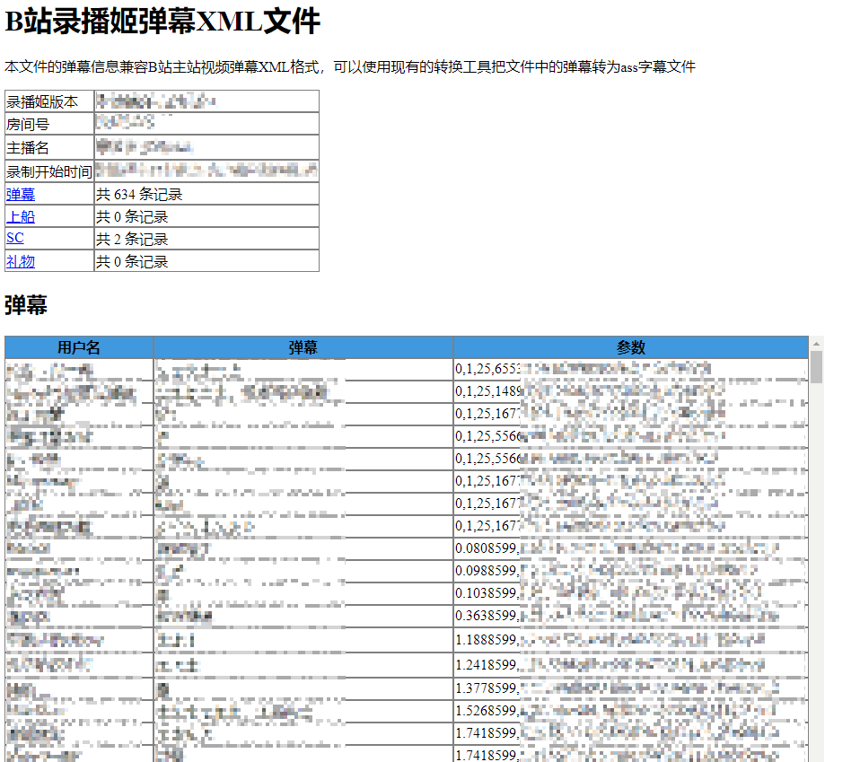
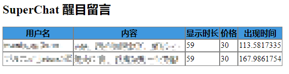

# 弹幕录制

录播姬支持在录制直播的同时保存直播弹幕。

录播姬还支持保存

- 普通弹幕
- SuperChat (付费醒目留言)
- 赠送礼物
- 舰长购买
- 上面四种信息的原始 JSON 数据

录播姬保存的弹幕 XML 文件格式兼容B站主站弹幕 XML 格式。

## 设置

录制弹幕功能默认为关闭状态，可以在全局设置或直播间单独设置里启用。

“录制弹幕” 是其他所有设置项的总开关，设置为关闭之后，其他所有信息都不会录制。

弹幕原始数据是从弹幕服务器接收到的原始数据，如果不需要建议不要打开。  
启用录制弹幕原始数据会大幅度增加弹幕文件的大小（大约 3 到 5 倍）。

## 查看弹幕

录播姬输出的弹幕文件可以直接在现代浏览器内打开查看。这个功能不支持 IE 等老旧浏览器。

弹幕部分的 **参数** 一列中，第一个逗号 `,` 前面的数字是弹幕出现的时间，单位是秒。  
参数兼容 B站主站弹幕 XML 文件，按顺序含义分别为：

1. 弹幕出现时间 (秒)
2. 弹幕类型
3. 字号
4. 颜色
5. 发送时间戳
6. 固定为 0 (主站弹幕 XML 为弹幕池 ID)
7. 发送者 UID (主站弹幕 XML 为发送用户 ID 的 CRC32)
8. 固定为 0 (主站弹幕 XML 为弹幕的数据库 ID)

???+ tip "正确的预览效果图"
    
    

!!! fail "不支持的浏览器"
    - IE (Internet Explorer)

!!! check "推荐使用的浏览器"
    - [Google Chrome](https://www.google.cn/chrome/){ target=_blank }
    - [Mozilla Firefox](https://www.firefox.com.cn/download/){ target=_blank }
    - [Microsoft Edge](https://www.microsoft.com/zh-cn/edge){ target=_blank }

## 加载到播放器

有两种方法可以把弹幕加载到播放器里做成类似看直播的效果。

方法1: 先转换成 ASS 字幕文件，再使用支持加载 ASS 字幕的播放器播放。（个人推荐）

方法2: 直接使用支持加载B站弹幕 XML 的播放器加载播放。

相关的播放器和格式转换软件请查看 [其他工具和项目](./other-projects.md) 页面。

## 压制到视频里

大部分转换工具只能读取录播姬弹幕XML里的普通弹幕，而 DanmakuFactory 从 v1.6x 开始支持转换录播姬的 礼物、舰长购买、SuperChat 数据。

把弹幕 XML 文件转换成 ASS 字幕文件后就可以使用支持压制 ASS 字幕的视频编码工具压制到视频文件里。

相关的视频处理工具和弹幕格式转换软件请查看 [其他工具和项目](./other-projects.md) 页面。
