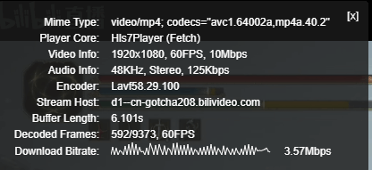

# 常见问题

<style>.md-content h3:before{content:'Q: ';color:var(--md-accent-fg-color);font-weight:bold}</style>

反馈QQ群：689636812  
闲聊QQ群：725135081 (只闲聊不解答问题)  
反馈邮箱： rec@danmuji.org

本页面主要面向录播姬桌面版编写，但其中大部分信息对命令行版也生效。

## 安装

### 不支持的操作系统

录播姬不支持部分老旧操作系统，具体请查看[软硬件要求](./system-requirements.md)一页。

### 下载文件不成功

有时微软 Edge 等浏览器会因为 “**该文件有可能是不需要的程序**” 之类的原因阻止下载文件。

解决方法：点击浏览器内下载文件图标旁边的菜单按钮（类似这样： :material-dots-vertical:、:material-dots-horizontal:、:fontawesome-solid-angle-up:），在菜单中选择 “**保留文件**” 或 “**继续下载**” 等选项。

### 操作系统阻止安装

有时 Windows 系统会弹出 “**SmartScreen 已保护你的电脑**” 的弹窗，阻止运行录播姬安装包。

解决方法：先点击弹窗上的一段文字 “**更多信息**”，这四个字的颜色会不太一样，然后就会显示出 “**仍要运行**” 的按钮。点击 “**仍要运行**” 即可。

### 安装时弹出错误 Installation has failed

有可能是系统缺少一些组件、或者系统是被修改过的（精简版等）导致的。

解决方法：尝试手动覆盖安装 [.NET Framework 4.8](https://dotnet.microsoft.com/zh-cn/download/dotnet-framework/thank-you/net48-offline-installer)，如果安装失败可能是你的操作系统版本太旧，已经不被支持了。

还有可能是杀毒软件在后台静默阻止了安装、或在后台静默删除了部分文件。

解决方法：暂时退出杀毒软件，或在杀毒软件里给录播姬添加白名单。

### 安装后录播姬闪退或报错

报错 “**未能加载文件或程序集**” 是因为录播姬所需要的文件被删除了，大部分情况下是杀毒软件在后台静默删除了一部分文件。

解决方法：在网站下载安装包，重新安装。（无需提前卸载，覆盖安装即可）

闪退崩溃还有可能是其他问题导致的，如操作系统故障、显卡驱动问题、电脑硬件问题等等。如果无法解决可以加QQ群或发邮件询问。

### (macOS) 无法打开“BililiveRecorder.Cli”，因为无法验证开发者。

macOS 存在安全限制，需要对程序进行临时签名才可运行。可以参考如下命令或者[图中](https://asciinema.org/a/4SepVOSkgCr9UNY5pqbpAgDVX?t=24)的操作：

```shell
# 移除 quarantine 属性
$ xattr -rd com.apple.quarantine .
# 本地临时签名
$ codesign -fs - --deep BililiveRecorder.Cli
```

## 使用

### 可以用录播姬录自己直播间吗？

可以，但是 **不推荐**。  
直播数据从B站服务器绕一圈容易出现各种玄学问题，并且会受到网络波动不可控因素影响。

建议使用直播软件自带的录制功能，稳定可靠占用低。

直播姬直接点击开播按钮旁边的录制按钮即可。

OBS 请检查 **设置** > **输出** > **录像** 中的 **录像质量**，设置为 **与串流画质相同**。  
如果使用的是高级输出模式，则是 **编码器** 设置为 **（使用推流编码器）**。

OBS 录制时推荐设置录制文件格式为 `MKV`，万一发生软件崩溃、系统断电等问题，文件还可以播放，不会损坏。  
如果需要 `MP4` 可以在录制结束后在 OBS 首页的 **文件** > **录像转封装** 里快速转封装格式。

### 不能切换到房间列表页面

要录制直播需要先选择一个工作目录，工作目录是保存配置文件和录像文件的地方。

如果在打开录播姬时点击了 **工具箱** 按钮，就只能使用工具箱里的功能，不能录直播。

### 选择工作目录时提示已有其他文件

录播姬需要一个专用的文件夹存放录像文件，不能选择桌面、用户文档文件夹、C盘根目录等路径。
请在有充足空间的位置新建一个文件夹给录播姬使用。

如果曾经在同一个位置使用过录播姬，突然开始提示 **已有其他文件** 了，可能是因为录播姬的配置文件丢失了。
录播姬的配置文件是工作目录里的 `config.json` 文件，同时会备份上一次写入的文件到 `config.backup.json`。
如果配置文件丢失了，可以把备份文件复制一份改名为 `config.json`。

### 日志中显示 根据修复逻辑的要求结束录制

如果收到了录播姬的修复系统无法处理的数据，就会主动断开录制并重连。

2022年7月：从 7 月 3 日左右开始，B站直播服务器给的直播数据新出现了一个问题，音视频数据的顺序不正确，虽然不影响播放但是会导致录播姬的数据修复系统无法正确判断。
临时解决办法：换原始数据模式录制。之后会对这个新问题做兼容。

两个录制模式的区别和对比：[录制模式](./record-mode.md)

### 日志里显示 “刷新房间时出错”、“尝试开始录制时出错”、“已取消一个任务”、“发送请求时出错”

这些基本全是因为网络问题，检查网络连接、检查是否设置了系统全局代理、如果有的话试一下禁用 IPv6（因为部分地区虽然分配了 IPv6 但无法联网导致请求失败）、试一下换一个网络环境。

### 录播姬日志中显示启动录制出错 NotFound

在直播刚开始时和最后结束时出现这个错误是正常情况。

开始直播时：

- 主播先在直播个人中心点击 “开始直播” 按钮
- 录播姬马上检测到直播间状态变为直播中，开始尝试录制
- 因为主播还没有在直播软件里开始推流，所以直播服务器返回 404 Not Found 错误
- 主播在直播软件里点击 “开始推流”
- 录播姬自动重试，开始正常录制

关闭直播时：

- 主播先在直播软件里点击 “停止推流”
- 直播服务器断开录播姬的连接
- 录播姬自动重试，直播服务器因为没有数据所以返回 404 Not Found 错误
- 主播在直播个人中心点击 “关闭直播” 按钮
- 录播姬检测到直播间状态不再是直播中，停止重试

<!-- 设置 -->

### 录制模式有什么区别？

请查看 [录制模式](./record-mode.md) 页面。

### 录制的弹幕文件怎么用？

可以直接在 Chrome、FireFox、Edge 等浏览器里打开。不支持 IE 浏览器。

其他使用方法请查看 [弹幕录制](./danmaku.md) 页面。

### 弹幕原始数据是什么？

弹幕原始数据是从B站直播弹幕服务器收到的原始 JSON。

如果你不了解它有什么作用，那你八成是不需要保存原始数据的。  
关闭 “保存弹幕原始数据” 可以大幅度减少弹幕文件的大小。

### 画质 ID 是什么？

画质 ID 决定了录播姬会录制哪个“画质”的直播，不同的画质全部都是B站直播服务器提供的。

具体设置说明请查看 [软件设置](./settings.md#画质ID) 页面。

### 可以录制 “原画 Pro” 吗？

带 “Pro” 字样的画质的视频编码格式是 HEVC (H.265)，压缩率更高、码率更低。  
“原画 Pro”(HEVC, H.265) 是从 “原画”(AVC, H.264) 二压出来的。

录播姬不支持录制 HEVC 流。

### 可以设置录制的码率吗？

不能，录播姬不会对直播画面重新编码，不能设置录像的码率。

请注意，画质 ID 不是码率设置。

### 可以设置录制的分辨率、帧率吗？

不能，录播姬不会对直播画面重新编码，不能设置录像的分辨率和帧率。

请注意，画质 ID 不是分辨率、帧率设置。

### 可以修改录制的文件格式吗？

不能，录播姬只能输出 FLV 文件。

如果需要 MP4 格式，推荐使用 [其他工具和项目](./other-projects.md) 页面给出的视频处理工具进行 **转封装** 操作。

录播姬桌面版的工具箱里也提供了转封装功能。

### 可以多开吗？怎么多开？

只要选择的工作目录不同，就可以同时运行多个录播姬。

同一个工作目录只能运行一个录播姬。

如果曾经在选择工作目录时勾选了 **不再询问**，可以在房间列表界面的 **文件** 菜单中点击 **切换工作目录** 然后取消勾选 **不再询问** 并确认。

??? note "关于命令行版"
    命令行版没有这个限制，不会检测是否有多个进程在同一个工作目录运行。不过一般来说不会有人会想要在同一个工作目录运行多个录播姬的，用户需要自己检查是否重复运行了。

### 勾选“记住工作目录”之后怎么修改工作目录？

在房间列表页面的 “文件” 菜单中选择 “修改工作目录” 选项。

### 怎么设置开机启动？

录播姬自身没有开机启动设置功能。

可以手动把录播姬的快捷方式复制到系统的 **启动** 文件夹内，启动文件夹的打开方式是：

1. 按 `Windows + R` 快捷键
2. 输入 `shell:startup`
3. 点击运行

可以参考 [桌面版 - 安装使用¶命令行参数](./install/wpf.md#命令行参数) 页面。

不推荐使用计划任务来实现开机启动，因为计划任务可能会在桌面环境运行之前执行，导致录播姬崩溃或出现其他问题。

??? note "关于命令行版"
    根据具体使用的是 “散装” 的可执行文件还是 Docker 镜像，以及不同的操作系统，实现开机启动的方法各不相同。

    比如 systemd 是 `systemctl enable <service-name>`  
    docker 是加上 `--restart unless-stopped`

    需要用户自行根据自己的使用方式来实现

<!-- 录制 -->

### 房间卡片上的状态条的颜色和箭头是什么意思？

颜色表示的是录制的“稳定”程度，绿色最好、红色最差。

箭头表示的是当前录制的速度是更快还是更慢  
:material-arrow-up-bold: 是当前录制的速度比主播直播的速度快（追赶进度）  
:material-arrow-down-bold: 是当前录制的速度比主播直播的速度快（落后进度）

原始数据模式的状态条显示为 白色/浅蓝色。  
录制速度只有标准模式才能统计到，原始数据模式因为是不经处理直接写入硬盘，所以没有这些统计信息。

### B站二压原画后如何录制真原画？

从大约 2022 年 3 月初开始，哔哩哔哩直播区会对大主播的 “原画” 画质进行二压，在此之前 “原画” 就是主播推流的原始数据。

二压原画的直播流 URL 有 `_blueray` 后缀，而真原画的直播流 URL 没有任何后缀。

```http
https://cn-example-host.bilivideo.com/live-bvc/000000/live_00000_0000000.flv?expires=....
https://cn-example-host.bilivideo.com/live-bvc/000000/live_00000_0000000_bluray.flv?expires=....
```

二压原画是动态码率，实际码率根据画面复杂度变化，metadata 中显示的码率为 10M (10000 kbps)。  
二压原画的音频码率通常是 125K。



只有在直播间观众达到一定数量之后才会启动直播转码，在刚开始直播观众很少的时候是只有真原画这一个选项的。

所以如果想要录真原画直播，需要：

- 在主播开始直播之前就打开录播姬、打开自动录制
- 主播开始直播后立刻开始录制
- 保持录制不断开，直到直播结束

如果录制断开了，重连时就只能获取到二压原画的直播流了。
