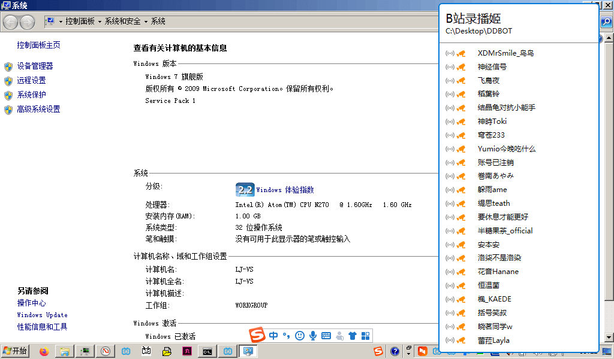
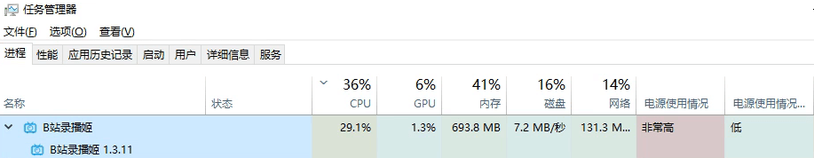
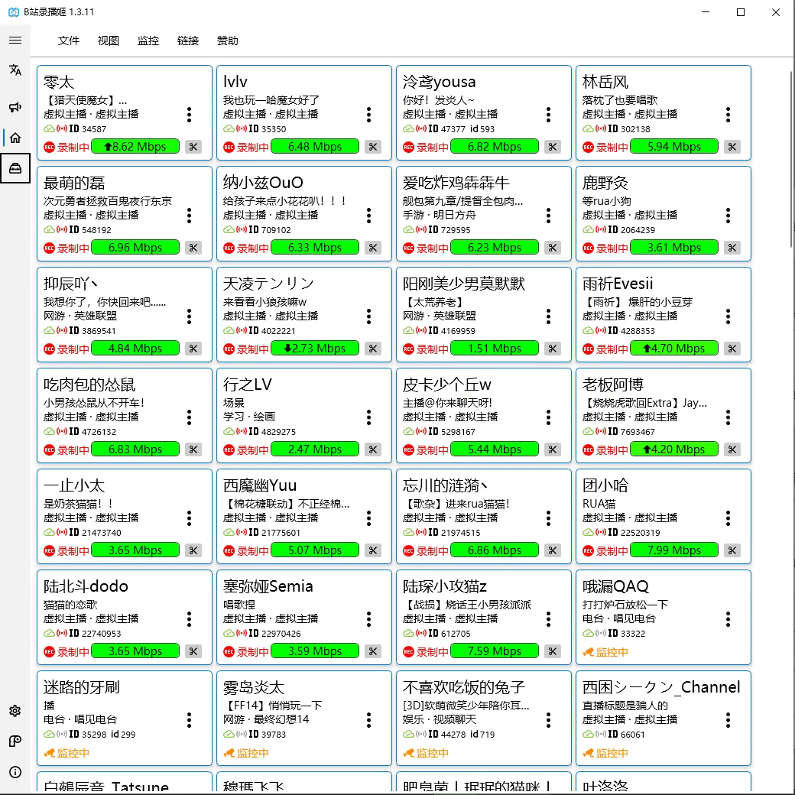

# 用户文档

录播姬是一个方便好用免费开源的直播录制工具（只支持某特定平台）

!!! tip inline end "Discord"
    <iframe src="https://discord.com/widget?id=1002130286374555648&theme=dark" width="350" height="500" allowtransparency="true" frameborder="0" sandbox="allow-popups allow-popups-to-escape-sandbox allow-same-origin allow-scripts"></iframe>

{ target=_blank title=在爱发电赞助我 }  
反馈 QQ 群: [689636812](https://jq.qq.com/?_wv=1027&k=5cXu8IHS){ target=_blank }  
邮箱: [rec@danmuji.org](mailto:rec@danmuji.org){ target=_blank }  
Discord: [https://discord.gg/YQWtUsbGSw](https://discord.gg/YQWtUsbGSw){ target=_blank }  

## 特点和功能

### 简单方便

下载、安装、选择保存位置、粘贴直播间链接，1 分钟即可开录。  
开始录制、停止录制，操作简单，本地录制mikufans直播回放。
### 自动录制

开播自动开始录制，响应速度极快（通常在 10 秒以内），能录到直播的最开头。

### 稳定可靠

经过了大量用户的使用和时间的检验，可 24×7 长时间稳定运行。

### 弹幕录制

支持同时录制直播弹幕，保存为兼容mikufans主站弹幕格式的 XML 文件。  
除了普通弹幕以外还支持保存赠送礼物、醒目留言/SuperChat、和购买舰长。

### 无损分段

本地分段不会断开与直播服务器的连接。

### 捕捉直播流、非录屏

录播姬直接连接直播服务器获取直播流，不是录制屏幕，没有二次压制。

### 直播数据修复

原创的mikufans直播数据修复系统，自动修复时间戳跳变、视频总时长显示为 0、主播PK连麦导致的花屏绿屏等mikufans录播的各种常见问题。

!!! bug "不支持修复的问题"
    目前录播姬有一种问题还不支持进行处理

### 低占用高性能

录播姬占用的系统资源少、性能高，可以同时录制很多直播间。

!!! info "提醒"
    录播姬作者并不推荐添加超大量直播间

???+ tip "用户案例 - Intel Atom N270"
    

???+ tip "用户案例 - Intel Core i7-6700T"
    

    注意右侧细细的滚动条，图片里显示了大约 1/4 的房间

    
