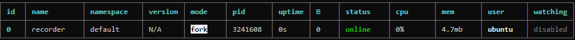

# 用 PM2 运行录播姬命令行版

[PM2](https://pm2.keymetrics.io/){rel="noopener noreferrer"} 是一个 Node.js 编写的进程管理器。

## 下载安装 PM2

Node.js 的安装请参考下面两个链接

- [https://nodejs.org/zh-cn/download/](https://nodejs.org/zh-cn/download/){rel="noopener noreferrer"}
- [https://nodejs.org/zh-cn/download/package-manager/](https://nodejs.org/zh-cn/download/package-manager/){rel="noopener noreferrer"}

安装 PM2:

```sh
# 详细信息请参考 PM2 的官方网站
sudo npm install pm2 -g
```

## 下载录播姬

下载链接和解压方法可以参考 [命令行版](./cli.md) 页面。

下面给出一个简单的例子：

```sh
mkdir brec
cd brec
# wget https://下载链接
unzip BililiveRecorder-CLI-linux-x64.zip
chmod +x BililiveRecorder.Cli

# 确认录播姬可以运行、并检查版本号
./BililiveRecorder.Cli --version
```

## 使用 PM2 启动录播姬

```sh
pm2 start --name recorder BililiveRecorder.Cli -- run --bind "http://*:2356" "录播工作目录"
```



!!! danger "重要安全提醒"
    如果要把录播姬的管理页面对公网开放，请一定一定一定做好安全措施，给录播姬设置一个密码，或使用其他有身份验证功能的反向代理软件。

    直接把没有身份验证的录播姬暴露到公网可能会有严重的安全风险。轻则被添加一大堆直播间导致硬盘塞满，重则可能会被任意上传下载文件。（理论上是不能通过录播姬来做到任意代码执行的，不过不做任何保证）

录播姬目前有 HTTP Basic 登录功能：

```sh
pm2 start --name recorder BililiveRecorder.Cli -- run --bind "http://*:2356" --http-basic-user "用户名" --http-basic-pass "密码" "录播工作目录"
```

其他录播姬的命令和参数请参考 [命令行版](./cli.md) 页面。

## 设置开机启动

参考 PM2 官方文档：[https://pm2.keymetrics.io/docs/usage/startup/](https://pm2.keymetrics.io/docs/usage/startup/){rel="noopener noreferrer"}

首先设置开机启动 PM2：

```sh
pm2 startup
# 然后复制粘贴并运行这条命令输出的命令。
```

```sh
pm2 save
```

## 查看和控制运行状态

```sh
pm2 ps

# "recorder" 是上面运行 pm2 start 时传入的 --name 参数
pm2 start recorder
pm2 stop recorder
pm2 restart recorder

pm2 logs recorder

pm2 delete recorder
```
