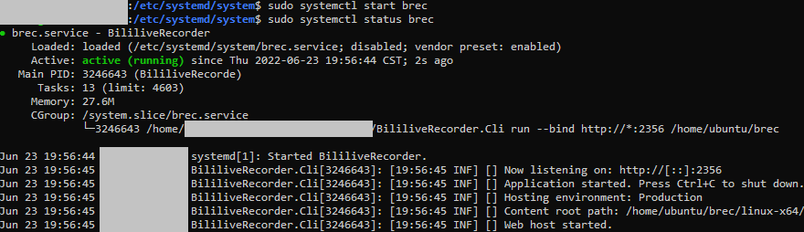

# 用 systemd 运行录播姬命令行版

## 下载录播姬

下载链接和解压方法可以参考 [命令行版](./cli.md) 页面。

下面给出一个简单的例子：

```sh
mkdir brec
cd brec
# wget https://下载链接
unzip BililiveRecorder-CLI-linux-x64.zip
chmod +x BililiveRecorder.Cli

# 确认录播姬可以运行、并检查版本号
./BililiveRecorder.Cli --version
```

## 创建服务

新建一个文件 `/etc/systemd/system/brec.service`

写入以下内容，注意调整 `ExecStart=` 后面的文件路径和参数。

```
[Unit]
Description=BililiveRecorder
After=network.target

[Service]
ExecStart=录播姬所在位置/BililiveRecorder.Cli run --bind "http://*:2356" --http-basic-user "用户名" --http-basic-pass "密码" "录播工作目录"

[Install]
WantedBy=multi-user.target
```

其他录播姬的命令和参数请参考 [命令行版](./cli.md) 页面。

!!! danger "重要安全提醒"
    如果要把录播姬的管理页面对公网开放，请一定一定一定做好安全措施，给录播姬设置一个密码，或使用其他有身份验证功能的反向代理软件。

    直接把没有身份验证的录播姬暴露到公网可能会有严重的安全风险。轻则被添加一大堆直播间导致硬盘塞满，重则可能会被任意上传下载文件。（理论上是不能通过录播姬来做到任意代码执行的，不过不做任何保证）

    从录播姬 2.6.3 开始也可以使用环境变量 `BREC_HTTP_BASIC_USER` 和 `BREC_HTTP_BASIC_PASS` 来设置用户名密码。

然后重载服务：

```sh
sudo systemctl daemon-reload
```

每次修改了 `brec.service` 文件后都需要运行这个命令重载一次。

启动录播姬：

```sh
sudo systemctl start brec
```



## 设置开机启动

```sh
sudo systemctl enable brec
```

可以用以下命令禁用开机启动

```sh
sudo systemctl disable brec
```

## 查看和控制运行状态

查看运行状态：

```sh
sudo systemctl status brec
```

运行、停止、重启：

```sh
sudo systemctl start brec
sudo systemctl stop brec
sudo systemctl restart brec
```

查看日志：

```sh
sudo journalctl -u brec.service
```

也可以直接查看录播姬旁边 logs 文件夹内的日志文件。
