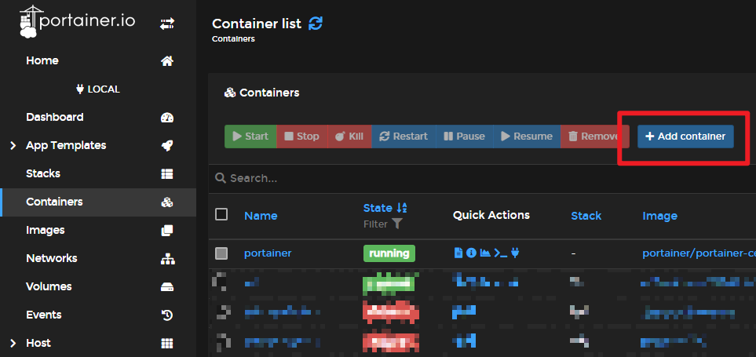
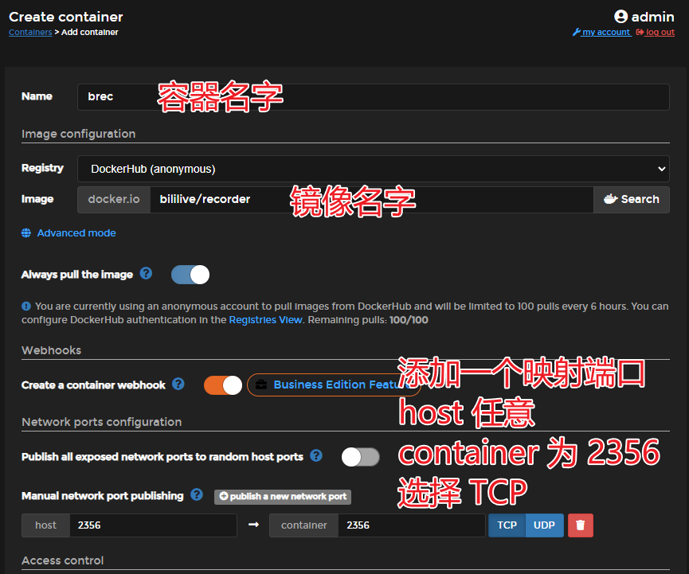
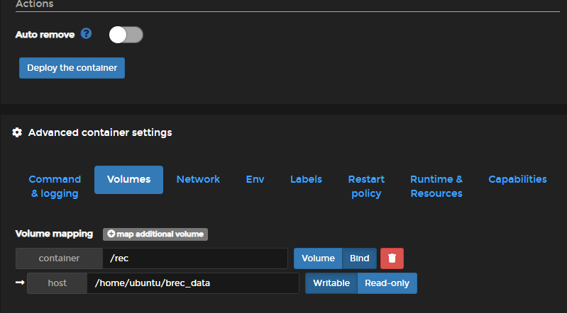
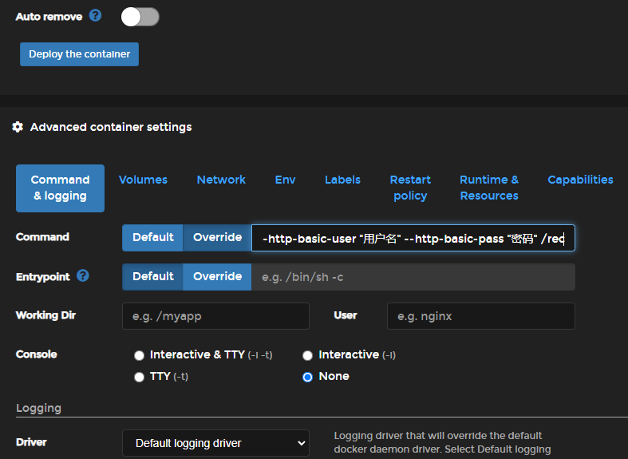
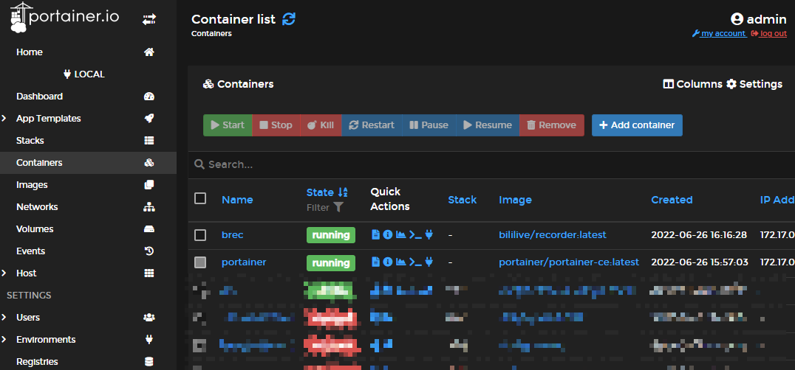

# 使用 Portainer 运行录播姬 Docker 版

Portainer 的安装使用请参考[官方网站 https://docs.portainer.io/](https://docs.portainer.io/){target=_blank rel="noopener noreferrer"}。

在 Containers 容器 页面点击 Add contianer 添加容器。



Name 容器名字随便写。

Image 填入 `bililive/recorder`。tag 可以不写，默认为 latest，关于 tag 可以参考 [Docker 镜像文档页](./docker.md) 和 [录播姬的 Docker Hub 页面](https://hub.docker.com/r/bililive/recorder/tags){target=_blank rel="noopener noreferrer"}。

点击下面的 publish a new network port 按钮，添加端口映射。  
container 端口写 2356。
host 随意，图里也写了 2356。访问管理界面时使用 宿主机 ip 地址 + 这里设置的 host 端口。
协议选择 TCP。



在页面下面的 Volumes 里添加文件夹映射。

点击 map additional volume 按钮。  
container 写入 `/rec`，然后选择 Bind 选项。  
在 host 中填入你的宿主机上保存录播数据的位置。  
注意不要把它设置为 Read-Only 只读。



!!! danger "重要安全提醒"
    如果要把录播姬的管理页面对公网开放，请一定一定一定做好安全措施，给录播姬设置一个密码，或使用其他有身份验证功能的反向代理软件。

    直接把没有身份验证的录播姬暴露到公网可能会有严重的安全风险。轻则被添加一大堆直播间导致硬盘塞满，重则可能会被任意上传下载文件。（理论上是不能通过录播姬来做到任意代码执行的，不过不做任何保证）

如果想要设置管理界面用户名密码，点击 “Command & Logging” 然后选择 Command 后面的 Override 选项，文本框中输入：

```
run --bind "http://*:2356" --http-basic-user "用户名" --http-basic-pass "密码" /rec
```



最后点击 Deploy the container 按钮部署。

效果如下：


