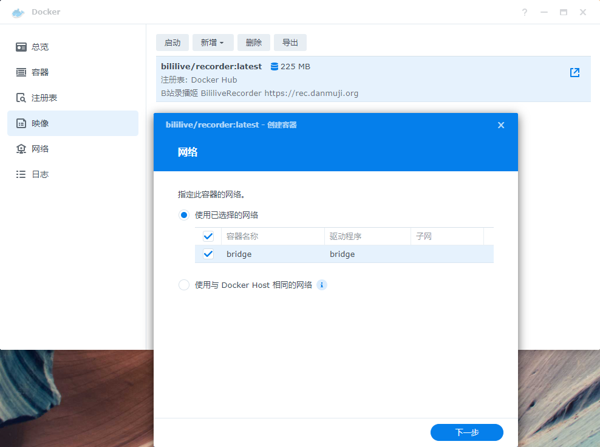

# 使用 群晖 Synology 运行录播姬 Docker 版

## 拉取 Docker 镜像文件

在 Docker 的 “注册表”（其实是镜像仓库） 中，右上角的搜索框输入 `bililive/recorder`，选择一个版本，并下载。


在 “映像”（其实应该是镜像） 页面中等待镜像下载完成。下载完成后也会有通知提示。


## 创建容器

在 “映像” 页面选中录播姬，点击上方的 “启动” 按钮。点击下一步。




!!! danger "重要安全提醒"
    如果要把录播姬的管理页面对公网开放，请一定一定一定做好安全措施，给录播姬设置一个密码，或使用其他有身份验证功能的反向代理软件。

    直接把没有身份验证的录播姬暴露到公网可能会有严重的安全风险。轻则被添加一大堆直播间导致硬盘塞满，重则可能会被任意上传下载文件。（理论上是不能通过录播姬来做到任意代码执行的，不过不做任何保证）

如果想要设置管理界面用户名密码，点击 “高级设置” 然后切换到 “执行命令”，在 “命令” 文本框中输入：

```
run --bind "http://*:2356" --http-basic-user "用户名" --http-basic-pass "密码" /rec
```


在 “端口设置” 这一步点击 “新增”，容器端口设置为 `2356`，本地端口可以是自动或者可以你自己选择一个端口号。类型为 TCP。


在 “存储空间设置” 这一步点击 “添加文件夹”，选择 NAS 里打算用于保存录播的文件夹。然后在 “装载路径” 文本框内输入 `/rec`。注意不要勾选 “只读”，否则无法写入文件。


检查设置，并创建容器。


## 最终效果

浏览器访问 `http://NAS的IP:本地端口` 即可打开录播姬的管理界面，比如下面图中的管理界面地址是 `http://192.168.1.5:49154`

群晖 Docker 的内存占用显示不准确，有时会显示录播姬使用了 几GB 甚至 几十GB 内存的情况，实际上没有使用这么多内存。


??? quote "."
    
