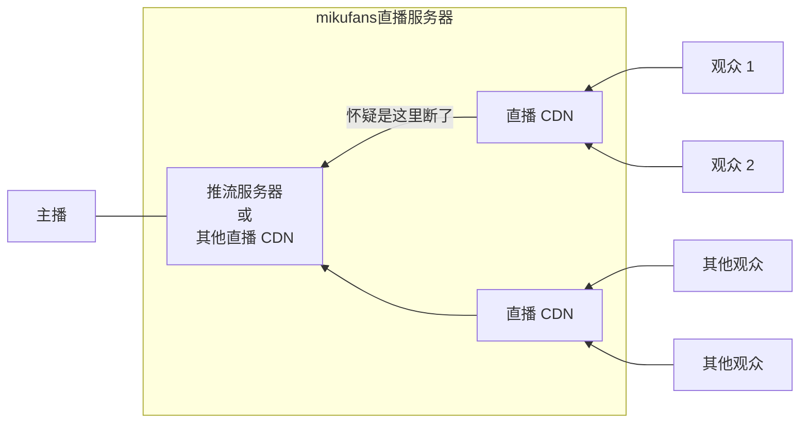

---
data_configType_map:
  roomOnly: 房间单独设置
  room: 全局设置和单独设置
  globalOnly: 仅全局设置
data_type_map:
  int: 数字 (int32)
  uint: 无符号数字 (uint32)
  bool: 布尔值 (boolean)
  "string?": 字符串 (string)
  AllowedAddressFamily: 枚举 (enum)
  RecordMode: 枚举 (enum)
  CuttingMode: 枚举 (enum)
  
---
# 软件设置

查看本页面时可以使用目录快速跳转到要找的内容。  
电脑上目录在页面内容的右侧。  
手机上先点击页面左上角的 :material-menu: 图标，再点击当前页面 **软件设置** 就会打开目录。

## 高级设置

本页面列出了录播姬软件的所有设置，其中有一部分设置被标记为了 “:material-cogs:{style=color:#ff3c26} 高级设置”。
这些设置项通常不需要被修改，随意修改可能会导致录播姬无法正常工作。

录播姬桌面版显示高级设置的方式是：鼠标右键点击两次界面左下角的设置按钮。

## 设置项


<!-- 设置项长说明区域开始 -->



| 键 | 值 | 含义 |
| -- | -- | --- |
| `RecordMode.Standard` | 0 | 标准模式 |
| `RecordMode.RawData` | 1 | 原始数据模式 |

关于录制模式的说明见 [录制模式](./record-mode.md)




| 键 | 值 | 含义 |
| -- | -- | --- |
| `CuttingMode.Disabled` | 0 | 不分段 |
| `CuttingMode.ByTime` | 1 | 按视频时长分段 |
| `CuttingMode.BySize` | 2 | 按文件大小分段 |




根据 CuttingMode 设置的不同：    
当按时长分段时，本设置的单位为分钟。  
当按大小分段时，本设置的单位为MiB。




是否录制弹幕，`true` 为录制，`false` 为不录制。

本设置同时是所有“弹幕录制”的总开关，当本设置为 `false` 时其他所有“弹幕录制”设置无效，不会写入弹幕 XML 文件。




是否记录原始 JSON 数据。

弹幕原始数据会保存到 XML 文件每一条弹幕数据的 `raw` attribute 上。

当 `RecordDanmaku` 为 `false` 时本项设置无效。




是否记录 SuperChat。

当 `RecordDanmaku` 为 `false` 时本项设置无效。




是否记录礼物。

当 `RecordDanmaku` 为 `false` 时本项设置无效。




是否记录上船（购买舰长）。

当 `RecordDanmaku` 为 `false` 时本项设置无效。




录制的直播画质 qn 值，以英文逗号分割，靠前的优先。

**注意**：

- 所有主播刚开播时都是只有 “原画” 的，如果选择不录原画会导致直播开头漏录。
- 如果设置的录制画质里没有原画，但是主播只有原画画质，会导致不能录制直播。
- 录播姬不会为了切换录制的画质主动断开录制。
- 这个设置项 **不是录制码率** 。
- 这个设置项也不是录制分辨率、录制帧率。

??? cite "画质 ID 对照表"
    画质 | qn 值
    :--:|:--:
    杜比 | 30000
    4K   | 20000
    原画 | 10000
    蓝光(杜比) | 401
    蓝光 | 400
    超清 | 250
    高清 | 150
    流畅 | 80




请参考[文件名格式](./file-name-template.md)页面。




这个设置项是在录播姬 2.1.0 添加的。默认是关闭。2.0.0 以及之前的版本相当于这个设置是开启状态。

直播服务器有时会多次发送本应只在直播流最开头发送一次的 metadata 信息，同时在这前后可能会有重复的直播数据，或者缺少直播数据。录播姬会检测完全一致的重复数据并删除。
造成这个问题的原因可能是直播服务器与它上一级直播服务器的连接断开了。



主播连麦PK、主播直播软件断开重连也可能会导致直播服务器多次发送 metadata 信息。

当这个设置项设置为 **开启** 状态时，收到 metadata 信息后会对录播文件分段。2.0.0 及更早的版本也是这个行为。

当这个设置项设置为 **关闭** 状态时，收到 metadata 信息后会在当前录播文件同名的一个 txt 文件里记录当前视频时间等信息，不会分段。

请注意遇到这个问题的位置可能会缺少几秒直播画面，可以根据你自己对录播文件的用法来决定是分开更方便后期处理、还是合并在一起更方便后期处理。




请参考[Webhook](./webhook.md)页面。




请参考[Webhook](./webhook.md)页面。




只在桌面版（WPF版）有效




| 键 | 值 | 含义 |
| -- | -- | --- |
| `AllowedAddressFamily.System` | -1 | 由系统控制和决定
| `AllowedAddressFamily.Any` | 0 | 由录播姬随机选择任意地址
| `AllowedAddressFamily.Ipv4` | 1 | 由录播姬选择 IPv4 地址
| `AllowedAddressFamily.Ipv6` | 2 | 由录播姬选择 IPv6 地址




请参考[用户脚本](./user-script.md)页面。


<!-- 设置项长说明区域结束 -->



-----

### {{ setting.name }} { id=s-{{ setting.id }} }


:material-cogs:{style=color:#ff3c26} 此设置项为[高级设置](#高级设置)，不显示在普通设置界面。


| 设置ID | 设置类型 | 数据类型 |
| ------ | ------- | ------- |
| `{{setting.id}}` | {{ data_configType_map[setting.configType] }} | {{data_type_map[setting.type] or '`' ~ setting.type ~ '`'}} |



!!! example "默认设置"

    ```csharp
    {{ 'true' if setting.default else 'false' }}
    ```

    ```csharp
    {{ setting.default }}
    ```

    _(空字符串)_

    ```jinja
    {{ setting.default }}
    ```

    ```txt
    {{ setting.default }}
    ```



{{ longDescriptions[setting.id] }}



-----
